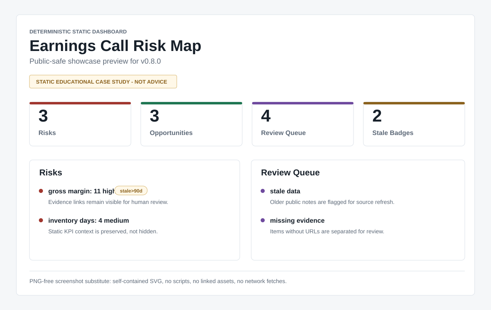

# earnings-call-risk-map

Turn earnings-call notes into deterministic risk maps, review queues, and static dashboards.

Zero-dependency Python CLI. No LLM, database, API key, workflow dependency, or live market feed.

Quickstart:

1. Generate the bundled demo artifacts:

   ```bash
   PYTHONPATH=src python -m earnings_call_risk_map demo --out-dir examples/output
   ```

2. Analyze one fixture:

   ```bash
   PYTHONPATH=src python -m earnings_call_risk_map analyze examples/input/demo_company.json
   ```

3. Open the demos: [dashboard](examples/output/demo_dashboard.html), [report](examples/output/demo_report.md), [review queue](examples/output/demo_review_queue.md), or [demo index](docs/demo-index.html).

Command details: [docs/usage.md](docs/usage.md). Positioning: [generic LLM comparison](docs/comparison-to-generic-llm-notes.md) and [promotion pack](examples/output/promotion_pack.md).

> Educational research review only. This tool does not provide personalized investment, legal, accounting, tax, buy, sell, or hold advice. Outputs preserve stale/static data warnings and should be reviewed against source materials.

## Contents

- [Badges And Links](#badges-and-links)
- [Local-Only No-Network Guarantee](#local-only-no-network-guarantee)
- [2-Minute Walkthrough](#2-minute-walkthrough)
- [Static-Data Badge](#static-data-badge)
- [Integration Examples](#integration-examples)
- [Research Playbooks](#research-playbooks)
- [Roadmap](#roadmap)
- [Quickstart](#quickstart)
- [Commands](#commands)
- [Fixture Schema](#fixture-schema)
- [Repository Layout](#repository-layout)
- [Verification](#verification)

## Badges And Links



**Release:** `v0.9.0` | **Runtime dependencies:** `0` | **Workflows:** `none` | **Preview format:** `SVG + static HTML`

- [Pages demo guide](docs/pages-demo.md)
- [Demo screenshot guide](docs/demo-screenshot-guide.md)
- [First 30 minutes tutorial](docs/tutorial-first-30-minutes.md)
- [Analyst tutorial](docs/tutorial-earnings-review.md)
- [Gallery](docs/gallery.md)
- [Promotion page outline](docs/promotion-page-outline.md)
- [Generated promotion pack](examples/output/promotion_pack.md)
- [Roadmap](docs/roadmap.md)
- [Distribution guide](docs/distribution.md)
- [Release owner handoff](docs/release-owner-handoff.md)
- [Publication checklist](docs/publication-checklist.md)
- [Maintenance routine](docs/maintenance.md)
- [Comparison to spreadsheets and generic notes](docs/comparison-to-spreadsheets.md)
- [Comparison to generic LLM notes](docs/comparison-to-generic-llm-notes.md)
- [Research playbooks](examples/playbooks/README.md)
- [Data entry checklist](docs/data-entry-checklist.md)
- [Reusable blank JSON templates](docs/templates.md)
- [Fixture summary onboarding](docs/fixture-summary.md)
- [Semiconductor equipment adaptation guide](docs/sector-adaptation-semiconductor-equipment.md)
- [Troubleshooting](docs/troubleshooting.md)
- [Known limitations](docs/known-limitations.md)
- [Non-advice boundary](docs/non-advice-boundary.md)
- [Risk language taxonomy](docs/risk-language-taxonomy.md)
- [Generated risk taxonomy artifact](examples/output/risk_language_taxonomy.md)
- [Source attribution guide](docs/source-attribution-guide.md)
- [Security and privacy](docs/security-and-privacy.md)
- [Case study limitations](docs/case-study-limitations.md)
- [Case study map docs](docs/case-study-map.md)
- [Generated case study map](examples/output/case_study_map.md)
- [v0.9.0 release notes draft](docs/release-notes-v0.9.0.md)
- [Reviewer feedback consumption](docs/reviewer-feedback-consumption.md)
- [Demo dashboard HTML](examples/output/demo_dashboard.html)
- [PNG-free screenshot substitute](examples/output/showcase_dashboard_preview.svg)

The project keeps financial-safety boundaries explicit:

- Management claims are source-provided company statements or prepared remarks. The tool surfaces them for review and does not verify them as facts.
- Analyst questions are source-provided prompts from Q&A or research materials. They are treated as questions, not assertions.
- User synthesis is user-authored notes, tags, and deterministic tool scoring. It is a review aid, not investment advice or a recommendation.
- [Known limitations](docs/known-limitations.md) consolidates static-data, no-live-fetching, scoring, source-trust, advice, and portfolio-suitability limits.

## Local-Only No-Network Guarantee

All package commands are designed to run from local files only. They do not call APIs, open sockets, fetch live market data, read credential environment variables, require workflow runners, or require a database.

The `audit` command records this guarantee in machine-readable form. Its local-only checks verify:

- `pyproject.toml` declares no runtime package dependencies.
- Package and script sources contain no network-client imports.
- Package and script sources contain no credential environment variable reads.
- No `.github/workflows` files are required to run the package commands.

The test suite also runs every CLI subcommand with a minimal credential-free environment to confirm the commands do not need API keys, tokens, secrets, passwords, proxies, or cloud credentials.

## 2-Minute Walkthrough

From a source checkout:

```bash
PYTHONPATH=src python -m earnings_call_risk_map version
PYTHONPATH=src python -m earnings_call_risk_map analyze examples/input/demo_company.json
PYTHONPATH=src python -m earnings_call_risk_map analyze examples/input/demo_energy_infrastructure.json
PYTHONPATH=src python -m earnings_call_risk_map analyze examples/input/public_apple_static_case_study.json
PYTHONPATH=src python -m earnings_call_risk_map analyze examples/input/demo_company.json --html-out examples/output/demo_dashboard.html
PYTHONPATH=src python -m earnings_call_risk_map review-queue examples/input/demo_company.json --md-out examples/output/demo_review_queue.md --json-out examples/output/demo_review_queue.json
PYTHONPATH=src python -m earnings_call_risk_map review-queue-jsonl --out examples/output/demo_review_queue_items.jsonl
PYTHONPATH=src python -m earnings_call_risk_map handoff-packet --md-out examples/output/handoff_packet.md --json-out examples/output/handoff_packet.json
PYTHONPATH=src python -m earnings_call_risk_map playbooks --format markdown --out examples/output/playbooks.md
PYTHONPATH=src python -m earnings_call_risk_map compare examples/output/demo_prior_snapshot.json examples/output/demo_snapshot.json --md-out examples/output/demo_compare.md --json-out examples/output/demo_compare.json
PYTHONPATH=src python -m earnings_call_risk_map case-study-map --format markdown --out examples/output/case_study_map.md
PYTHONPATH=src python -m earnings_call_risk_map data-entry-checklist --format markdown --out examples/output/data_entry_checklist.md
PYTHONPATH=src python -m earnings_call_risk_map cheat-sheet --format markdown --out examples/output/command_cheat_sheet.md
PYTHONPATH=src python -m earnings_call_risk_map audit --format markdown
PYTHONPATH=src python -m earnings_call_risk_map release-assets --format markdown
PYTHONPATH=src python -m earnings_call_risk_map demo --out-dir examples/output
PYTHONPATH=src python -m earnings_call_risk_map maturity-evidence --out-dir reports/maturity
```

What just happened: `version` verifies imports; `analyze`, `review-queue`, `review-queue-jsonl`, `handoff-packet`, `playbooks`, `compare`, `case-study-map`, `data-entry-checklist`, and `cheat-sheet` generate review artifacts; `audit`, `release-assets`, `demo`, and `maturity-evidence` verify release parity and regenerate bundled evidence. The Apple fixture is a static public-source case study, not live data.

Sample output excerpt:

```markdown
> Educational research review only. This tool does not provide personalized investment, legal, accounting, tax, buy, sell, or hold advice.

## Source Boundaries

- Management claims: source-provided company statements or prepared remarks; verify against filings and transcripts.
- Analyst questions: source-provided questions or prompts; they are not treated as factual claims.
- User synthesis: user-authored notes, tags, and deterministic tool scores; they are review prompts, not advice.

## Summary

- Risks: 3
- Opportunities: 3
- Review queue: 2
- Stale/static badges: 2

## Risks

- **gross margin**: 11 (high), `stale>90d`
  Evidence: https://example.com/exm/channel-check
- **Inventory days**: 4 (medium), `stale>90d`
  Evidence: https://example.com/exm/static-kpi

## Review Queue

- **gross margin**: data is stale; high-impact language
- **product launch**: missing evidence URL
```

Focused review-queue excerpt:

```markdown
## Summary

- Review items: 4
- Stale data: 2
- Missing evidence: 2
- High-impact language: 1
```

Compare interpretation excerpt:

```markdown
## How To Read This Compare

- Deltas compare deterministic keyword scores between analyzed snapshots; they are prompts for source review, not investment conclusions.
- Risk attention increased for: gross margin, Inventory days, revenue durability.
- Opportunity attention increased for: product launch.
```

## Static-Data Badge

Each note, KPI, and catalyst carries a date. The tool compares that date to the fixture's `as_of` date and labels the item:

- `current`: dated within 90 days.
- `stale>90d`: older than 90 days and preserved in the output instead of hidden.
- `date-unverified`: missing or invalid date metadata.

These badges are intentionally visible because a stale public KPI can look authoritative after its context has expired.

## Integration Examples

Outputs are plain Markdown, JSON, and self-contained HTML. They can be handed to adjacent research tools without adding runtime dependencies on those tools:

- [docs/comparison-to-spreadsheets.md](docs/comparison-to-spreadsheets.md) explains when the CLI is a better or worse fit than spreadsheets and generic notes.
- [docs/comparison-to-generic-llm-notes.md](docs/comparison-to-generic-llm-notes.md) explains when to use deterministic CLI artifacts versus one-off LLM notes.
- [docs/tutorial-first-30-minutes.md](docs/tutorial-first-30-minutes.md) walks a cold user from clone to template selection, analysis, review queue, and handoff.
- [docs/fixture-summary.md](docs/fixture-summary.md) shows how cold users can check source types, stale badges, and fixture counts before reading a full report.
- [docs/tutorial-earnings-review.md](docs/tutorial-earnings-review.md) walks through an analyst-style review from fixture to report to review queue to compare.
- [docs/integrations.md](docs/integrations.md) shows mappings for thesis-ledger notes and portfolio risk review items.
- [docs/decision-ledger-integration.md](docs/decision-ledger-integration.md) shows how to paste outputs into an investment thesis ledger while preserving non-advice boundaries.
- [docs/gallery.md](docs/gallery.md) lists the generated demo artifacts and machine-readable handoff examples.
- [docs/demo-screenshot-guide.md](docs/demo-screenshot-guide.md) explains which generated HTML, SVG, and Markdown artifacts make good screenshots or README visuals.
- [docs/promotion-page-outline.md](docs/promotion-page-outline.md) provides public landing-page copy, screenshot targets, comparison positioning, and marketing boundaries.
- [examples/output/case_study_map.md](examples/output/case_study_map.md) maps bundled fixtures to target sectors, reviewer questions, and generated artifacts.
- [docs/pages-demo.md](docs/pages-demo.md) explains how to view the static HTML dashboards locally and what to screenshot.
- [docs/public-case-study.md](docs/public-case-study.md) documents the static public-source Apple case study and its attribution boundary.
- [docs/sector-adaptation-semiconductor-equipment.md](docs/sector-adaptation-semiconductor-equipment.md) shows how to adapt the fixture workflow to semiconductor-equipment earnings review while preserving static-data and non-advice boundaries.
- [docs/case-study-limitations.md](docs/case-study-limitations.md) explains static source limitations, source freshness, fixture replacement, and non-advice safeguards.
- [docs/release-readiness.md](docs/release-readiness.md) documents the release review template and maturity evidence bundle.
- [docs/release-owner-handoff.md](docs/release-owner-handoff.md) summarizes the final v0.9 release owner checklist, exact verification commands, and promotion evidence paths.
- [docs/publication-checklist.md](docs/publication-checklist.md) lists public GitHub release owner steps for smoke checks, privacy scan, skill path review, tagging, and `gh release`.
- [docs/reviewer-evidence.md](docs/reviewer-evidence.md) summarizes exact reviewer verification commands, fresh clone validation, release assets, and maturity scores.
- [docs/reviewer-feedback-consumption.md](docs/reviewer-feedback-consumption.md) summarizes how prior reviewer feedback shaped v0.9 product clarity, reproducibility, demo evidence, and risk boundaries.
- `examples/output/integration_notes.json` contains static example records derived from the demo snapshot and review queue.

## Research Playbooks

The repo includes deterministic playbooks for recurring research workflows:

- [Quarterly Review](examples/playbooks/quarterly-review.md): full quarter-end report, review queue, dashboard, and compare flow.
- [Catalyst Check-In](examples/playbooks/catalyst-check-in.md): focused catalyst-date, stale-data, and missing-evidence review.
- [Post-Earnings Thesis Refresh](examples/playbooks/post-earnings-thesis-refresh.md): post-call source-boundary review before updating a thesis ledger or memo.

## Roadmap

See [docs/roadmap.md](docs/roadmap.md) for v0.7+ roadmap items, file-based integration ideas, explicit project boundaries, and star-worthy use cases that keep the package local, deterministic, and review-oriented.

## Quickstart

Supported Python versions: Python `3.9` or newer.

Optional local install:

```bash
python -m pip install .
earnings-call-risk-map version
earnings-call-risk-map analyze examples/input/demo_company.json --json-out examples/output/demo_snapshot.json --md-out examples/output/demo_report.md --html-out examples/output/demo_dashboard.html
```

For `pipx`, wheel dry-run, and troubleshooting notes, see [docs/distribution.md](docs/distribution.md). The package is prepared for local distribution checks, but this repository does not require publishing to use the CLI.

## Commands

- `analyze`: reads one JSON fixture and writes or prints a Markdown report plus optional JSON snapshot and static HTML dashboard.
- `review-queue`: writes or prints deterministic Markdown/JSON for only stale data, missing evidence, and high-impact language.
- `review-queue-jsonl`: writes or prints deterministic JSON Lines review item records across bundled demo fixtures, including fixture context and normalized review item payloads.
- `handoff-packet`: writes or prints deterministic Markdown/JSON summarizing the report path, review queue JSONL path, compare path, handoff targets, and cautions for portfolio/thesis workflows.
- `playbooks`: writes or prints available research playbooks and recommended CLI sequences in Markdown or JSON.
- `publication-checklist`: writes or prints public GitHub release owner steps in Markdown or JSON.
- `data-entry-checklist`: writes or prints fixture author data-entry checks, field mappings, and validation commands in Markdown or JSON.
- `demo-screenshot-guide`: writes or prints screenshot target, framing, and boundary guidance in Markdown or JSON.
- `template-catalog`: writes or prints blank template paths, recommended fields, and starter commands in Markdown or JSON.
- `fixture-summary`: writes or prints a compact Markdown/JSON summary of one fixture's source types, stale badges, source boundaries, and onboarding counts.
- `case-study-map`: writes or prints the bundled case study fixture map in Markdown or JSON.
- `demo`: builds `demo_*`, `energy_infrastructure_*`, `consumer_hardware_*`, `semiconductor_equipment_*`, and `public_apple_static_case_study_*` artifacts, package audit files, and a demo release manifest.
- `compare`: compares two analyzed JSON snapshots and adds a plain-language interpretation section. Positive deltas mean a topic drew more deterministic risk or opportunity score in the later snapshot; negative deltas mean the later snapshot drew less score. When comparing software and energy infrastructure fixtures, read the output as cross-fixture differences in checked-in inputs and domain vocabulary, not investment ranking or buy, sell, hold advice. Deltas are review prompts only, so reviewers should verify source documents and freshness badges before treating a movement as resolved or newly material.
- `audit`: writes or prints package parity in JSON or Markdown.
- `cheat-sheet`: writes or prints a lightweight command cheat sheet with every CLI command and short purpose in Markdown or JSON.
- `release-assets`: writes or prints a JSON/Markdown checklist for expected release assets and exits nonzero when any are missing.
- `manifest`: writes a deterministic release manifest with file hashes.
- `maturity-evidence`: writes JSON and Markdown release maturity evidence under `reports/maturity` by default.
- `version`: prints the package version.

## Fixture Schema

Input fixtures are documented in [docs/input-schema.md](docs/input-schema.md). Required fields are `company`, `ticker`, `as_of`, and `data_cutoff`; dates must use valid `YYYY-MM-DD` strings. Validation errors include the fixture path and field name so malformed fixtures fail before scoring. See [docs/source-attribution-guide.md](docs/source-attribution-guide.md) for source attribution choices and [docs/troubleshooting.md](docs/troubleshooting.md) for common validation errors, stale badges, missing evidence, and compare interpretation.

Reusable blank templates for software, energy infrastructure, and consumer hardware reviews are documented in [docs/templates.md](docs/templates.md) and stored under `examples/templates/`.

## Repository Layout

- `src/earnings_call_risk_map/`: standard-library-only package.
- `examples/input/`: deterministic public fixtures.
- `examples/templates/`: reusable blank JSON templates for new earnings reviews.
- `examples/output/`: demo output artifacts.
- `examples/playbooks/`: deterministic research workflow playbooks.
- `docs/assets/`: static documentation assets, including the SVG dashboard preview.
- `docs/`: usage, scoring, gallery, and integration notes.
- `docs/security-and-privacy.md`: local-only, no-credential, no-workflow, and privacy scan assumptions.
- `reports/reviews/`: release review templates.
- `tests/`: `unittest` suite.
- `scripts/selfcheck.py`: local verification runner.
- `scripts/privacy_scan.py`: public-safety text scan.
- `scripts/maturity_evidence.py`: standalone release maturity evidence generator.
- `skills/agent/earnings-call-risk-map/SKILL.md`: public agent skill.

## Verification

```bash
PYTHONPATH=src python -m unittest discover -s tests
PYTHONPATH=src python scripts/selfcheck.py
PYTHONPATH=src python -m earnings_call_risk_map audit
PYTHONPATH=src python -m earnings_call_risk_map maturity-evidence --out-dir reports/maturity
python scripts/privacy_scan.py
```

No `.github/workflows` files are included.
